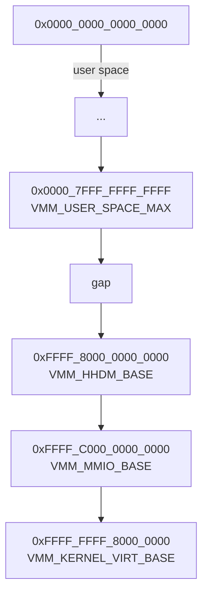

# TheOS-Reborn


TheOS-Reborn is a freestanding x86_64 OS project with a Multiboot2 kernel, custom VMM/PMM, SMP, ext4, ring3 userland, a minimal libc and a MicroPython port.

> This README reflects the repository state as of **March 2026**.

---

## Table of Contents

- **Overview**
- **Feature Overview**
  - Stable
  - Experimental
  - Known Gaps
- **Architecture at a Glance**
  - Boot & runtime pipeline
  - Virtual memory layout
  - Isolation / security model
- **Build & Run**
  - Prerequisites
  - Cross-toolchain
  - Configure, build, run
  - Runtime QEMU options
- **Disk Image & Userland**
- **Syscalls**
- **LibC Status**
- **Logging & Debugging**
- **Roadmap**

---

## Overview

TheOS-Reborn is a “from-scratch” 64‑bit OS kernel and userland for x86_64:

- Multiboot2 bootloader entry, higher-half kernel at `0xFFFFFFFF80000000`.
- Custom physical and virtual memory managers with strict kernel/user split.
- SMP bring-up, APIC/IOAPIC, HPET-timed LAPIC scheduling.
- ext4-based root filesystem and ring3 ELF processes.
- A small but practical libc plus several userland apps, including a MicroPython port.


> The donut above is generated from the current repository LOC counts via `Meta/gen-graphs.sh`.
> You can regenerate it with:
> ```bash
> ninja -C Build graphs
> ```

It is meant as a **learning and experimentation playground** more than a production OS.

---

## Feature Overview

### Stable / Working

- **Boot & CPU**
  - Multiboot2 boot + long mode + higher-half kernel.
  - Startup identity map kept during bring-up, dropped after SMP is online.
  - NX detection and enable path.
- **Virtual memory**
  - Split layout:
    - Lower half: user space (`<= 0x00007FFFFFFFFFFF`).
    - Higher half: kernel/HHDM/MMIO (`>= 0xFFFF800000000000`).
  - Kernel mappings are supervisor-only; user mappings are explicit `USER_MODE`.
  - HHDM globally fixed and shared on all CPUs.
  - Explicit, uncached MMIO mappings through dedicated MMIO window.
- **Isolation / safety**
  - Per-process address spaces (own `CR3`).
  - `SYS_MAP/SYS_UNMAP/SYS_MPROTECT` restricted to a user mmap window.
  - Kernel space and other processes are blocked from mmap APIs.
  - W^X: writable+executable mappings are rejected.
  - NX enforced on non-executable regions when supported.
- **Interrupts, timers, SMP, FPU**
  - APIC/IOAPIC with ACPI MADT parsing and IRQ overrides.
  - LAPIC timer calibrated against HPET.
  - SMP bring-up (INIT/SIPI), AP online, per-CPU queues, TLB shootdown.
  - Eager FPU context switching (save/restore on task switch, no lazy TS/#NM).
  - AVX/XSAVE context on bare metal when CPUID/XCR0 allow it, with optional fallback to SSE-only under hypervisors when XRSTOR is unreliable.
- **Storage & FS**
  - AHCI storage with MSI-X/MSI and fallback paths.
  - ext4 mount from AHCI, with Multiboot2 `bootdev` preference.
- **Userland**
  - Ring3 ELF launch at boot (`/bin/TheApp`), then process syscalls (`fork/execve/waitpid/kill`).
  - Shell (`TheShell`), regression test app (`TheTest`), and MicroPython (`TheMicroPython`).
- **Console**
  - Early VGA text init.
  - Framebuffer console: PSF2 font load, scroll, backspace, blinking cursor.
  - Deferred switch from VGA to framebuffer after PSF2 load.
  - Double buffering when backbuffer allocation succeeds.
- **Logging**
  - Serial KDEBUG logs.
  - Optional file sink (RAM‑buffered until ext4 is ready).
  - Run logs mirrored to `Build/serial.log` by `Meta/run.sh`.

### Partially Working / Experimental

- x2APIC support behind `THEOS_ENABLE_X2APIC_SMP_EXPERIMENTAL` (default OFF).
- NUMA detection (SRAT/SLIT) without NUMA-aware allocator/scheduler yet.
- Process model is minimal (no COW, no full Unix semantics).

### Known Gaps

- ext4 implementation is intentionally limited (no journaling, constrained write path).
- libc is partial (enough for current apps/ports, not full POSIX).
- No userland thread API/runtime yet.
- Signals are minimal: fault→signal translation + `SIGKILL` via `SYS_KILL` only.
- MicroPython port:
  - REPL usable.
  - Script execution still has some unresolved limitations.

---

## Architecture at a Glance

### Boot & Runtime Pipeline

```mermaid
flowchart TD
    A[GRUB / Multiboot2] --> B[Bootloader.S<br/>multiboot_entry]
    B --> C[k_entry (Entry.c)]
    C --> D[PMM / VMM init]
    D --> E[ACPI / APIC / IOAPIC / HPET]
    E --> F[AHCI + ext4 mount]
    F --> G[SMP init<br/>AP bring-up]
    G --> H[TTY / framebuffer switch]
    H --> I[Launch /bin/TheApp (ring3)]
    I --> J[TheShell / other userland apps]
```

### Virtual Memory Layout



Key points:

- **User space** lives entirely in the canonical lower half.
- **HHDM** maps physical memory 1:1 at a fixed high-half virtual base.
- **Kernel code/data** live in the `VMM_KERNEL_VIRT_BASE` window.
- **MMIO** has its own uncached region above HHDM.

### Isolation / Security Model

- Per-process `CR3` with only:
  - user mappings in lower half;
  - supervisor-only kernel/HHDM mappings in higher half.
- mmap/syscalls limited to a user window (no direct mapping of kernel or other processes).
- W^X and NX enforced at the VMM / syscall layer.
- User stack follows SysV ABI (`argc`, `argv[]`, `envp[]`).

---

## Build & Run

### Prerequisites (Ubuntu/Debian)

```bash
sudo apt update
sudo apt full-upgrade
sudo apt install -y \
  gcc binutils make cmake ninja-build libmpc-dev \
  qemu-system-x86 grub-pc-bin xorriso mtools
```

### Cross Toolchain

TheOS-Reborn uses a dedicated cross toolchain in `Toolchain/Local/x86_64`:

```bash
cd Toolchain
./build.sh
```

### Configure & Build

From the repository root:

```bash
mkdir Build
cd Build
cmake .. -GNinja
ninja create-disk install-run
```

Useful `ninja` targets (from `Build/`):

```bash
ninja create-disk   # build/populate ext4 disk image
ninja iso           # build bootable ISO
ninja run           # run QEMU with TheOS.iso
ninja install-run   # install + iso + run
```

### Main CMake Options

Top-level:

- `THEOS_QEMU_NUMA_DEFAULT` (default `ON`)
- `THEOS_KERNEL_FS_DISK_IMG` (default `OFF`)

`THEOS_KERNEL_FS_DISK_IMG`:

- `OFF`: ext4 root is embedded into `TheOS.iso` by the `iso` target.
- `ON`: ext4 root comes from external `disk.img` (`create-disk` required).

Kernel options:

- `THEOS_ENABLE_KDEBUG` (default `ON`)
- `KERNEL_DEBUG_LOG_SERIAL` (default `ON`)
- `KERNEL_DEBUG_LOG_FILE` (default `ON`)
- `THEOS_ENABLE_SCHED_TESTS` (default `OFF`)
- `THEOS_ENABLE_X2APIC_SMP_EXPERIMENTAL` (default `OFF`)
- `THEOS_ENABLE_KVM` (default `ON`) – controls whether `ninja run` passes `-enable-kvm` to QEMU.

Examples:

```bash
cd Build

# Use external disk.img as root fs instead of embedded ext4
cmake -GNinja -DTHEOS_KERNEL_FS_DISK_IMG=ON ..

# Re-enable scheduler stress tests at boot
cmake -GNinja -DTHEOS_ENABLE_SCHED_TESTS=ON ..
```

### Runtime Options (`Meta/run.sh`)

Environment variables (most useful):

- `THEOS_RAM_SIZE` (default `128M`)
- `THEOS_QEMU_CPU` (default `max`)
- `THEOS_QEMU_GPU` (`vga` or `virtio`, default `vga`)
- `THEOS_DISK_NAME` (default `disk.img`)
- `THEOS_BOOT_FROM_ISO_DISK`
  - `1` (default): ext4 root embedded in `TheOS.iso`
  - `0`: root from external `disk.img`
- `THEOS_QEMU_NUMA` (`0` or `1`)
  - with `THEOS_NUMA_NODE0_MEM`, `THEOS_NUMA_NODE1_MEM` when enabled.
- `THEOS_QEMU_KVM` (`1` default, `0` to run without KVM acceleration)

Notes:

- `ninja -C Build run` sets `THEOS_QEMU_NUMA` based on `THEOS_QEMU_NUMA_DEFAULT`.
- GRUB is configured for a single, hidden, zero-timeout framebuffer entry.

---

## Disk Image & Userland

`Meta/disk.sh` stages `Base/` and installs:

- `/bin/TheApp`
- `/bin/TheShell`
- `/bin/TheTest`
- `/bin/TheMicroPython`
- `/bin/MicroPython` (alias)

Keyboard/font base files:

- `/system/keyboard.conf`
- `/system/azerty.conf`
- `/system/fonts/ter-powerline-v14n.psf` (default runtime font)

### TheApp

- Boot userland entry app.
- Prints a hello message, then `execve("/bin/TheShell", ...)`.

### TheShell

- Built-in commands: `pwd`, `cd`, `ls`, `cat`, `touch`, `mkdir`, `echo <text> | <path>`, `help`, `exit`.
- Executes binaries from `/bin` (supports aliases like `test` → `/bin/TheTest`).
- Uses libc keyboard/scancode layer with configurable layout (`/system/keyboard.conf` → `azerty.conf`).

### TheTest

- Security/regression test app for syscall behavior:
  - mmap boundary tests.
  - unmap edge cases.
  - fork/wait race scenarios.
  - deliberate fault probes.

### TheMicroPython

- Built as a standalone userland app from `ports/theos`.
- Supports REPL and script execution (`--help`, script path).
- Integrated with TheOS keyboard input and Ctrl+C polling hook.

---

## Syscalls (Current Surface)

Current syscall enum range: `1..27`.

**Filesystem / IO**

- `SYS_FS_LS`, `SYS_FS_READ`, `SYS_FS_CREATE`, `SYS_FS_WRITE`
- `SYS_OPEN`, `SYS_CLOSE`, `SYS_FS_SEEK`, `SYS_FS_ISDIR`, `SYS_FS_MKDIR`
- `SYS_CONSOLE_WRITE`, `SYS_KBD_GET_SCANCODE`

**Timing / system info**

- `SYS_SLEEP_MS`, `SYS_TICK_GET`, `SYS_CPU_INFO_GET`, `SYS_SCHED_INFO_GET`
- `SYS_AHCI_IRQ_INFO_GET`, `SYS_RCU_SYNC`, `SYS_RCU_INFO_GET`

**Process / memory**

- `SYS_EXIT`, `SYS_FORK`, `SYS_EXECVE`, `SYS_WAITPID`, `SYS_KILL`, `SYS_YIELD`
- `SYS_MAP`, `SYS_UNMAP`, `SYS_MPROTECT`

---

## LibC Status

- Focused on:
  - syscall wrappers;
  - `stdio` / `printf` subset;
  - string/memory helpers;
  - minimal `errno` / headers for porting (e.g. MicroPython).
- Keyboard input path:
  - in libc `stdio` (`getchar/fgets`);
  - scancode parsing with Shift/Caps/AltGr and layout files.
- `strings.h` includes `strcasecmp`, `strncasecmp`.
- Headers like `math.h`, `errno.h`, `stddef.h`, `limits.h` expanded for compatibility.
- Still incomplete vs POSIX:
  - many `unistd.h` APIs are declared but unimplemented.
  - no userland heap allocator (`malloc/free/realloc/calloc`) yet.

---

## Logging & Debugging

- Serial run logs are written to **`Build/serial.log`** when using `ninja -C Build run`.
- Kernel debug file sink:
  - logs to RAM first;
  - flushes to ext4 once the filesystem is mounted.
- File sink output files:
  - `kdebug.log`
  - `kdebug.log.<n>` (extra chunks)
  - `kdebug.log.overflow` (if RAM buffer overflows before flush)

For deep debugging you can:

- Attach **GDB** to QEMU (`-s` option in `Meta/run.sh`).
- Use QEMU tracing flags via `THEOS_QEMU_DEBUG` (see comments in `Meta/run.sh`).

---

## Roadmap / Current Priorities

- Harden process / memory / filesystem semantics.
- Expand libc coverage for larger userland ports.
- Stabilize MicroPython script execution.
- Extend ext4 write capabilities beyond the current single-block-oriented constraints.
- Move toward a richer userland scheduling/threading model.
