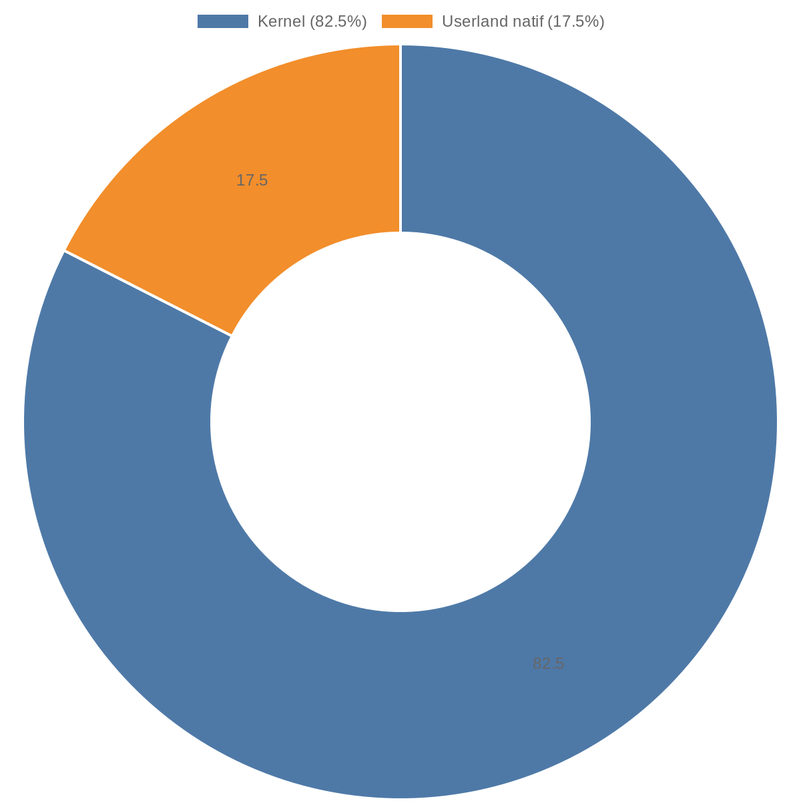
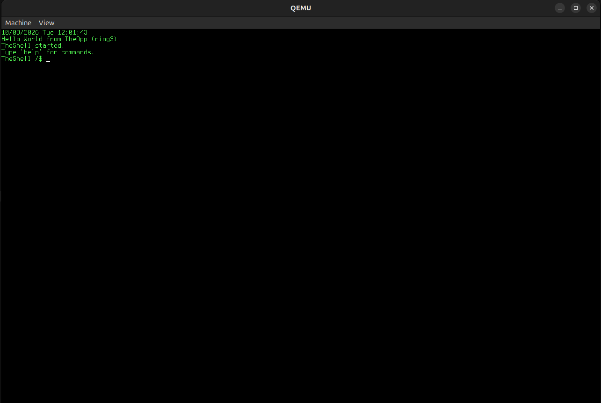
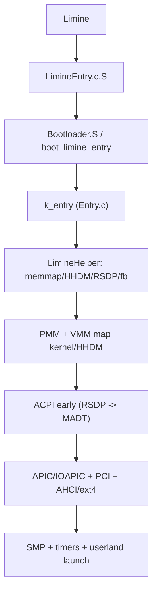

# TheOS-Reborn


TheOS-Reborn is an experimental x86_64 operating system project with a full boot stack in one repository.
It currently boots with Limine, runs a higher-half kernel, mounts ext4 over AHCI, and launches ring3 apps linked against a shared `libc.so`.
Runtime components are split across `Kernel`, `Driverland` (ring3 service domain for system daemons), and `Userland`.

> This README reflects repository behavior as of **March 22, 2026**.

---

## Table of Contents

- [Overview](#overview)
- [What TheOS Is (And Is Not Yet)](#what-theos-is-and-is-not-yet)
- [Features](#features)
- [Stability](#stability)
- [Current Boot Sequence](#current-boot-sequence)
- [Boot Screenshot](#boot-screenshot)
- [Memory Model (Limine-first)](#memory-model-limine-first)
- [Architecture at a Glance](#architecture-at-a-glance)
- [Build & Run](#build--run)
- [Configuration Options](#configuration-options)
- [Disk Image & Userland](#disk-image--userland)
- [Syscalls](#syscalls)
- [Logging & Debugging](#logging--debugging)
- [Known Gaps](#known-gaps)
- [License](#license)
- [Roadmap](#roadmap)

---

## Overview

Project goals:

- Learn OS internals on real x86_64 abstractions.
- Keep a full boot-to-userland stack in one repository.
- Favor explicit low-level behavior over hidden magic.

Current stack includes:

- Limine native entry (`Boot/LimineEntry.c.S` -> `boot_limine_entry` -> `k_entry`).
- Higher-half kernel with runtime relocation support from Limine executable address response.
- PMM + VMM with HHDM and dedicated MMIO mapping window.
- ACPI initialization from Limine-provided RSDP (no legacy BIOS scan).
- APIC/IOAPIC + HPET/PIT + SMP bring-up.
- AHCI storage and ext4 root mount.
- Ring3 ELF launch (`/bin/TheApp`, then shell and apps).



To regenerate graphs:

```bash
ninja -C Build graphs
```

---

## What TheOS Is (And Is Not Yet)

TheOS currently is:

- a real booting x86_64 OS target (not just host-side simulation code),
- a learning and experimentation platform for low-level kernel/userland boundaries,
- a single-repo environment to iterate on memory, scheduler, filesystem, graphics, audio, and runtime pieces together.

TheOS is useful for:

- validating end-to-end OS changes quickly (boot -> mount -> exec -> user app),
- testing POSIX-like libc wrappers against a custom syscall ABI,
- iterating on graphics/audio bring-up with a real user workload (`embeddedDOOM`),
- studying dynamic linking and TLS behavior in a constrained but practical environment.

TheOS is not yet:

- a production-hardened Unix clone,
- a complete POSIX implementation,
- a desktop OS with full Linux compatibility (DRM/KMS, audio, pthread, loader, and fs semantics are intentionally scoped).

---

## Features

Core features currently implemented:

- Limine-native boot entry with higher-half kernel handoff.
- Limine-first boot metadata usage:
  - runtime kernel base relocation,
  - HHDM offset,
  - memory map ingestion,
  - RSDP ACPI initialization path,
  - framebuffer discovery/selection,
  - boot-media hints for root filesystem selection.
- Custom PMM/VMM stack with:
  - page-based physical allocator,
  - HHDM mapping policy,
  - kernel/user split,
  - startup identity map and later teardown,
  - dedicated MMIO mapping window.
- ACPI/APIC/IOAPIC stack:
  - MADT parsing,
  - IRQ override handling,
  - APIC enable path and IOAPIC routing.
- SMP bring-up:
  - AP startup and online tracking,
  - inter-CPU tests and TLB shootdown paths.
- Timing stack:
  - HPET initialization,
  - LAPIC timer calibration,
  - PIT fallback path.
- Storage and filesystem:
  - AHCI controller discovery and IRQ mode setup (MSI/MSI-X/legacy fallback),
  - AHCI block-device support for both SATA disks and ATAPI media,
  - VFS root abstraction with ext4 backend wiring,
  - ext4 root mount with preferred Limine hint path and controlled fallback probing.
- Console and graphics:
  - early VGA path,
  - PSF2 font loading,
  - deferred framebuffer switch,
  - optional double buffering,
  - minimal DRM/KMS stack for userland (`/dev/dri/card0`, resources/connectors/CRTC/plane ioctls, dumb buffers, mmap, atomic commit),
  - Bochs/QEMU VGA mode-set path wired through DRM atomic mode blobs (connector mode list from Limine + runtime reprogramming in kernel).
- Audio:
  - Intel HDA playback path (`/dev/dsp`, `/dev/audio`) with OSS-style ioctls (`RESET/SYNC/SPEED/STEREO/SETFMT/GETFMTS/SETFRAGMENT`),
  - fragment-aware buffering in kernel HDA path (lower-latency queue depth control),
  - embeddedDOOM software music backend (MUS event playback + software synth mixed with SFX).
- Networking:
  - Intel E1000e (82574L) PCI path on QEMU (`-device e1000e`) with RX/TX descriptor rings and MSI/MSI-X/legacy fallback,
  - raw Ethernet device node (`/dev/net0`) with `read/write` for full L2 frames,
  - Linux-style ioctls for raw net path (`FIONREAD`, `FIONBIO`, `NET_RAW_IOCTL_GET_STATS`) and ARP table ops (`SIOCGARP`, `SIOCSARP`, `SIOCDARP`),
  - in-kernel ARP table with dynamic learning/expiry and Driverland-gated mutation ioctls (`SIOCSARP`/`SIOCDARP`),
  - AF_INET socket baseline in kernel/libc with UNIX-like wrappers (`socket`, `bind`, `connect`, `listen`, `accept`, `send`, `recv`, `sendto`, `recvfrom`, `getsockname`, `getpeername`),
  - UDP baseline (datagram sockets) with loopback and E1000/ARP-backed L2 emission path,
  - TCP baseline (stream sockets) with SYN handshake, listen/accept, connected send/recv, and non-blocking controls (`FIONBIO`/`FIONREAD`).
- Userland/runtime:
  - ring3 ELF launch,
  - process execution domains (`Userland` and `Driverland`), with driver services installed under `/drv`,
  - `TheApp` supervisor launches `/drv/TheDHCPd` and `/bin/TheShell`, with respawn policies,
  - shared executable loader baseline in kernel (`execve`) for both `ET_EXEC` and `ET_DYN` user ELFs,
  - process syscalls (`fork/execve/waitpid/kill`) with COW fork handling,
  - timer-driven userland preemption hook (experimental/tuning),
  - libc UNIX-style wrappers (`read/write/open/close/lseek`, `execv/execvp/execl/execlp`, `access/stat/mkdir`, `waitpid/kill`, `mmap/munmap/mprotect`, `brk/sbrk`, `opendir/readdir/closedir`, `clear_screen`),
  - thread-safe userland heap (`malloc/calloc/realloc/free`, `posix_memalign`, `aligned_alloc`),
  - TLS-backed `errno` and dynamic TLS module plumbing (`__libc_tls_module_register`, `__tls_get_addr`, unregister),
  - `libdl` baseline (`dlopen/dlsym/dlclose/dlerror`) with runtime shared-object loading/unloading (`.so`),
  - file-backed `mmap` baseline for regular files (`MAP_PRIVATE`) and shared dma-buf mappings (`MAP_SHARED`),
  - shared `libc.so` build artifact exported to rootfs (`/lib/libc.so`) while keeping static `libUserLibC.a` for tooling/ports that still need it,
  - user apps built through `theos_add_user_app` are dynamically linked by default (`NEEDED: libc.so`, rpath `/lib`, auto-injected `crt0` + dynamic linker script),
  - `pthread` layer backed by shared-address-space kernel threads (no `fork/waitpid` emulation),
  - centralized app runtime build helper (`theos_add_user_app`) that auto-injects `crt0.S` and the canonical user linker script,
  - shell aliases including `doom -> /bin/embeddedDOOM`,
  - shell, tests, power manager, system monitor, MicroPython, and embeddedDOOM app,
  - Driverland/service-domain stdout mirroring to `kdebug` (hidden from interactive shell TTY).

---

## Stability

`Status: experimental` means:

- Behavior is actively evolving and boot/runtime order may still change between commits.
- Backward compatibility (internal APIs, syscall details, build defaults) is not guaranteed.
- Subsystems can be individually stable while overall integration still has edge cases.
- Regressions are possible when low-level memory, SMP, storage, or interrupt code is modified.

What it does **not** mean:

- It is not a non-booting prototype. The current tree boots, mounts ext4, brings up SMP, and launches userland.
- It is not abandonware; active refactors and instrumentation are ongoing.

---

## Current Boot Sequence

The runtime order in `k_entry` is intentionally staged and observable in `Build/serial.log`:

1. **Limine loads kernel image** (`/boot/TheOS`) and jumps to Limine entrypoint.
2. **Assembly handoff** (`limine_entry` -> `boot_limine_entry`) switches to kernel stack and enters `k_entry`.
3. **Early debug sinks**: VGA TTY + logger + serial/file kdebug init.
4. **Limine base revision check** and runtime kernel base resolution (physical + virtual).
5. **PMM base init** with runtime kernel boundaries.
6. **Limine boot info parse**:
   - HHDM offset,
   - cmdline,
   - memory map (`memmap_request`),
   - RSDP pointer,
   - executable source hints (`mbr_disk_id`, partition index),
   - framebuffer discovery/selection.
7. **VMM map kernel**:
   - maps kernel image,
   - maps HHDM from Limine-derived boot entries,
   - keeps startup identity map during early bring-up.
8. **Load CR3**, **reload GDT**, enable NX path when supported.
9. **Early ACPI path from Limine RSDP** (RSDT/XSDT init), then MADT fetch and ACPI power init.
10. **IDT init** and BSP FPU init.
11. **APIC/IOAPIC/NUMA path** (if MADT + APIC available).
12. **PCI scan** (ACPI is already resolved before this stage).
13. **Keyboard + syscall init**.
14. **Root filesystem mount**:
   - prefer Limine boot-media hint (`mbr_disk_id_hint` + optional partition hint),
   - fallback to wider AHCI probing only if preferred path fails.
15. **Framebuffer activation deferred** until PSF2 font is loaded from ext4.
16. **Task init** then **SMP bring-up** of APs.
17. **Drop startup identity map** after SMP is online.
18. **Timer stack init** (HPET preferred for LAPIC calibration, PIT fallback).
19. **Enable interrupts**, start LAPIC timers on BSP/APs.
20. **Launch ring3 userland** (`/bin/TheApp` -> `/drv/TheDHCPd` + `/bin/TheShell`).

---

## Boot Screenshot

Early boot/runtime capture (serial + framebuffer path):



---

## Memory Model (Limine-first)

### Physical memory input source

The kernel now uses **Limine memmap as the source of truth**:

- `limine_memmap_request` entries are classified and stored in PMM boot entries.
- Each boot entry tracks:
  - physical range,
  - Limine memmap type,
  - flags: `allocatable` and `hhdm_map`.

### PMM policy

- PMM allocates pages only from entries considered allocatable (`LIMINE_MEMMAP_USABLE`).
- Low memory under `0x100000` is never managed by PMM.
- Kernel image pages are never returned by allocator.

### VMM/HHDM policy

- HHDM mappings are built from boot entries flagged `hhdm_map` (not only PMM-usable ranges).
- This allows safe access to needed non-allocatable ranges (for example ACPI data, framebuffer, bootloader reclaimable areas while still in early boot).
- If no boot entries are available, VMM falls back to legacy usable-region mapping.

### Virtual layout

- User canonical lower half up to `0x00007FFFFFFFFFFF`.
- Kernel/HHDM/MMIO in higher half.
- Default constants:
  - `VMM_HHDM_BASE = 0xFFFF800000000000`
  - `VMM_MMIO_BASE = 0xFFFFC00000000000`
  - `VMM_KERNEL_VIRT_BASE = 0xFFFFFFFF80000000`

ASCII view:

```text
0xFFFFFFFFFFFFFFFF  +-----------------------------------------------+
                    | Kernel higher-half mappings                    |
0xFFFFFFFF80000000  +-----------------------------------------------+  VMM_KERNEL_VIRT_BASE
                    | MMIO window (uncached mappings)               |
0xFFFFC00000000000  +-----------------------------------------------+  VMM_MMIO_BASE
                    | HHDM direct map (phys + offset)               |
0xFFFF800000000000  +-----------------------------------------------+  VMM_HHDM_BASE
                    | non-canonical gap                             |
0x0000800000000000  +-----------------------------------------------+
                    | User virtual address space                    |
0x0000000000000000  +-----------------------------------------------+
```

---

## Architecture at a Glance

### Boot pipeline



### CPU and interrupt subsystem

- APIC/IOAPIC configured from ACPI MADT.
- IRQ overrides handled from MADT records.
- MSI/MSI-X path for AHCI when available.
- HPET-backed LAPIC calibration preferred; PIT fallback remains available.

### Network stack (current baseline)

- L2:
  - Intel E1000e driver with RX/TX descriptor rings and IRQ delivery (MSI/MSI-X with fallback).
  - raw Ethernet endpoint exposed as `/dev/net0`.
- L3:
  - IPv4 framing/parsing path.
  - ARP table with learning, expiry, lookup, and Driverland-gated mutation.
- L4:
  - UDP datagram sockets (loopback + NIC egress).
  - TCP stream sockets (SYN handshake, listen/accept, connected send/recv baseline).
- User-facing APIs:
  - UNIX-like libc wrappers for AF_INET sockets (`socket`, `bind`, `connect`, `listen`, `accept`, `send`, `recv`, `sendto`, `recvfrom`),
  - `ioctl(FIONREAD/FIONBIO)` support on socket-backed descriptors.

### Userland model

- Ring3 ELF process start.
- `fork/execve/waitpid/kill/yield` path implemented.
- Copy-on-write (COW) clone path for writable user pages on `fork`.
- Timer-driven userland reschedule hook is present (still experimental/tuning in progress).
- Execution domains are exposed in proc snapshots (`SYS_PROC_INFO_GET`): `kernel`, `driverland`, `userland`.
- `/bin/TheApp` is domain-tagged as Driverland and supervises `/drv/*` services.
- Console writes from Driverland are routed to `kdebug` sink (not to shell TTY), while Userland apps keep normal TTY output.
- libc provides a `pthread` layer backed by shared-address-space user threads (kernel thread syscalls + FS-base TLS activation).
- libc `errno` is TLS-backed, and dynamic TLS modules can be registered/unregistered at runtime.
- Shell-centric workflow with additional user apps (`TheTest`, `ThePowerManager`, `TheSystemMonitor`, `TheMicroPython`).

---

## Build & Run

### Clone repository (with submodules)

```bash
git clone --recursive git@github.com:CodeMajorGeek/TheOS-Reborn.git
cd TheOS-Reborn
```

If the repository is already cloned:

```bash
git submodule sync --recursive
git submodule update --init --recursive
```

### Prerequisites (Ubuntu/Debian)

```bash
sudo apt update
sudo apt install -y \
  gcc binutils make cmake ninja-build git \
  libmpc-dev qemu-system-x86 xorriso mtools
```

### Cross toolchain

```bash
cd Toolchain
./build.sh
```

### Configure and build

```bash
mkdir -p Build
cd Build
cmake .. -GNinja
ninja install-run
```

Useful targets:

```bash
ninja create-disk   # build/populate ext4 disk image
ninja iso           # build bootable ISO
ninja run           # run QEMU with current ISO
ninja install-run   # install + iso + run
ninja graphs        # regenerate project graphs
```

### VirtualBox notes

- VirtualBox boot is supported when storage is exposed through a SATA/AHCI controller.
- If you boot from ISO with embedded ext4 rootfs, attach the ISO as an optical drive on the AHCI controller (ATAPI path).
- Legacy IDE-only controller setups are not used by the current storage path.

---

## Configuration Options

### Top-level CMake options

- `THEOS_HARDWARE_TEST_PROFILE` (default `OFF`)
  - when `ON`, forces hardware-like defaults (serial off, embedded disk path, no gdb/telnet monitor).
- `THEOS_QEMU_NUMA_DEFAULT` (default `ON`)
- `THEOS_KERNEL_FS_DISK_IMG` (default `OFF`)
  - `OFF`: ext4 embedded inside ISO.
  - `ON`: external `disk.img` rootfs.
- `THEOS_ENABLE_KVM` (default `ON`)
- `THEOS_RUN_SERIAL_CONSOLE` (default `ON`)
- `THEOS_RUN_GDB_STUB` (default `OFF`)
- `THEOS_RUN_TELNET_MONITOR` (default `OFF`)
- `THEOS_AUTO_PULL_SUBMODULES` (default `ON`)
  - initializes required submodules to pinned revisions during configure.
- `THEOS_AUTO_PULL_SUBMODULES_REMOTE` (default `OFF`)
  - optional remote-head update for selected tracked submodules (currently `EasyArgs` only).
- `THEOS_APPLY_EMBEDDEDDOOM_PATCHSET` (default `ON`)
  - auto-applies `Meta/patches/embeddedDOOM/*.patch` on top of the pinned `embeddedDOOM` submodule.

### embeddedDOOM patch persistence

The repository keeps `Userland/Apps/embeddedDOOM` as a submodule and versions TheOS-specific changes as patches in:

- `Meta/patches/embeddedDOOM/`

At configure time (`cmake ..`), `Meta/apply-embeddeddoom-patches.sh` applies that patchset. This keeps TheOS DOOM changes reproducible after a fresh `clone/pull`, without requiring a private fork.

### Kernel CMake options

- `THEOS_ENABLE_KDEBUG` (default `ON`)
- `KERNEL_DEBUG_LOG_SERIAL` (default `ON`)
- `KERNEL_DEBUG_LOG_FILE` (default `ON`)
- `THEOS_ENABLE_SCHED_TESTS` (default `OFF`)
- `THEOS_ENABLE_X2APIC_SMP_EXPERIMENTAL` (default `OFF`)

### Runtime options (`Meta/run.sh`)

Main environment controls:

- `THEOS_RAM_SIZE` (default `256M`)
- `THEOS_QEMU_CPU` (default `max`)
- `THEOS_QEMU_GPU` (`vga` or `virtio`, default `vga`)
- `THEOS_QEMU_NUMA` (`0`/`1`)
- `THEOS_QEMU_KVM` (`0`/`1`)
- `THEOS_QEMU_SERIAL` (`0`/`1`)
- `THEOS_QEMU_GDB_STUB` (`0`/`1`)
- `THEOS_QEMU_TELNET_MONITOR` (`0`/`1`)
- `THEOS_QEMU_AUDIO` (`0`/`1`, default `1`)
- `THEOS_QEMU_AUDIO_BACKEND` (`none|alsa|dbus|jack|oss|pa|pipewire|sdl|spice|wav`, default `pa`)
- `THEOS_QEMU_AUDIO_WAV_PATH` (default `theos-audio.wav`, used with backend `wav`)
- `THEOS_QEMU_NET` (`none|e1000e|socket`, default `e1000e`)
- `THEOS_QEMU_NET_SOCKET_MCAST` (default `230.0.0.42:23456`, socket backend endpoint)
- `THEOS_QEMU_NET_INJECT_ON_BOOT` (`0`/`1`, default `0`, enables raw frame injection helper for RX tests in socket mode)
- `THEOS_QEMU_NET_INJECT_DELAY_MS` (default `4000`)
- `THEOS_QEMU_NET_INJECT_COUNT` (default `3`)
- `THEOS_QEMU_NET_INJECT_INTERVAL_MS` (default `300`)
- `THEOS_QEMU_NET_INJECT_SIGNATURE` (default `THEOS_RX_AUTOTEST`)
- `THEOS_BOOT_FROM_ISO_DISK` (`1` embedded disk in ISO, `0` external disk image)

Limine config (`Kernel/Boot/limine.conf`) currently enables serial output:

```ini
serial: yes
serial_baudrate: 115200
```

---

## Disk Image & Userland

`Meta/disk.sh` stages `Base/` and installs:

- `/bin/TheApp`
- `/bin/TheShell`
- `/bin/TheTest`
- `/bin/ThePowerManager`
- `/bin/TheSystemMonitor`
- `/bin/TheMicroPython`
- `/bin/embeddedDOOM`
- `/drv/TheDHCPd`
- `/lib/libc.so`
- `/lib/libthetestdyn.so`

Runtime resources:

- `/system/keyboard.conf`
- `/system/azerty.conf`
- `/system/fonts/ter-powerline-v14n.psf`

`TheTest` currently exercises:

- mmap/unmap edge cases
- undefined-syscall -> `SIGSYS` behavior
- race behavior on ext4 file updates
- heap stress (`malloc/calloc/realloc/free`, `posix_memalign`, `aligned_alloc`)
- COW fork probe
- timer preemption probe (experimental)
- pthread shared-memory probe
- signal API/default-action probe (`signal`, `raise`, `kill`, wait status decoding)
- dynamic TLS module probe (`__libc_tls_module_register` / `__tls_get_addr` / unregister, including register/unregister churn)
- DRM/KMS probe (`/dev/dri/card0`, dumb buffer + dma-buf export/import + atomic test/commit/disable)
- OSS audio probe (`/dev/dsp`/`/dev/audio`, `SNDCTL_DSP_SETFRAGMENT` + tone playback)
- raw net probe (`/dev/net0`, tx/rx, `FIONREAD/FIONBIO`, driver stats)
- UDP socket probe (`AF_INET/SOCK_DGRAM`, bind/sendto/recvfrom, connected-UDP send/recv path, `FIONREAD/FIONBIO`)
- TCP socket probe (`AF_INET/SOCK_STREAM`, listen/accept/connect/send/recv loopback path)
- ARP table ioctl probe (`SIOCGARP/SIOCSARP/SIOCDARP`, Driverland-only mutation path)
- shared-object probe (`dlopen("/lib/libthetestdyn.so")`, symbol resolution, missing-symbol/missing-lib paths, open/close churn)

`TheShell` command UX:

- `doom` is a built-in alias for `embeddedDOOM`,
- `clear` now routes through libc `clear_screen()` (same helper reused by `TheSystemMonitor` and `TheTest` startup DRM sequence).

### Root filesystem selection policy

At boot, root mount does:

1. Try Limine executable-file hint (`mbr_disk_id_hint`, optional partition hint).
2. If that path fails, fallback probe on remaining AHCI block devices/partitions (SATA disks and ATAPI media).

---

## Syscalls

Current public syscall IDs are `1..44` (`Includes/UAPI/Syscall.h`).

- `1` `SYS_SLEEP_MS`
- `2` `SYS_TICK_GET`
- `3` `SYS_CPU_INFO_GET`
- `4` `SYS_SCHED_INFO_GET`
- `5` `SYS_AHCI_IRQ_INFO_GET`
- `6` `SYS_RCU_SYNC`
- `7` `SYS_RCU_INFO_GET`
- `8` `SYS_CONSOLE_WRITE`
- `9` `SYS_EXIT`
- `10` `SYS_FORK`
- `11` `SYS_EXECVE`
- `12` `SYS_YIELD`
- `13` `SYS_MAP`
- `14` `SYS_UNMAP`
- `15` `SYS_MPROTECT`
- `16` `SYS_OPEN`
- `17` `SYS_CLOSE`
- `18` `SYS_READ`
- `19` `SYS_WRITE`
- `20` `SYS_LSEEK`
- `21` `SYS_KBD_GET_SCANCODE`
- `22` `SYS_FS_ISDIR`
- `23` `SYS_FS_MKDIR`
- `24` `SYS_FS_READDIR`
- `25` `SYS_WAITPID`
- `26` `SYS_KILL`
- `27` `SYS_POWER`
- `28` `SYS_THREAD_CREATE`
- `29` `SYS_THREAD_JOIN`
- `30` `SYS_THREAD_EXIT`
- `31` `SYS_THREAD_SELF`
- `32` `SYS_THREAD_SET_FSBASE`
- `33` `SYS_THREAD_GET_FSBASE`
- `34` `SYS_PROC_INFO_GET`
- `35` `SYS_IOCTL`
- `36` `SYS_SOCKET`
- `37` `SYS_BIND`
- `38` `SYS_SENDTO`
- `39` `SYS_RECVFROM`
- `40` `SYS_CONNECT`
- `41` `SYS_GETSOCKNAME`
- `42` `SYS_GETPEERNAME`
- `43` `SYS_LISTEN`
- `44` `SYS_ACCEPT`

Behavior notes:

- `SYS_PROC_INFO_GET` returns per-entry `domain`, `flags`, `current_cpu`, `term_signal`, and `exit_status`.
- Unknown syscall numbers are treated as bad syscalls and terminate the owner process with `SIGSYS`.
- `SYS_IOCTL` currently multiplexes DRM (`/dev/dri/card0`), OSS audio (`/dev/dsp`/`/dev/audio`), raw net (`/dev/net0`), and AF_INET socket (`FIONREAD`/`FIONBIO`) requests.
- ARP mutation ioctls (`SIOCSARP`, `SIOCDARP`) are accepted only for Driverland-domain owners.

---

## Logging & Debugging

### Serial path

- Limine serial output is enabled in `limine.conf`.
- Kernel `kdebug` serial sink is enabled by default (`KERNEL_DEBUG_LOG_SERIAL=ON`).
- `Meta/run.sh` writes QEMU serial logs to `Build/serial.log` when serial console is enabled.

### Console routing by domain

- Userland `stdout/stderr` keep TTY behavior (`SYS_CONSOLE_WRITE` -> shell framebuffer/terminal + `kdebug` mirror).
- Driverland domain writes are suppressed on TTY and mirrored to `kdebug` only.
- This keeps supervisor/daemon logs visible in debug sinks without polluting interactive shell output.

### File sink

- Kernel logs are buffered in RAM first.
- Once ext4 is mounted, buffered logs are flushed to files such as:
  - `kdebug.log`
  - `kdebug.log.<n>`
  - `kdebug.log.overflow` (if pre-flush overflow happened)

### Debug helpers

- GDB stub: enable `THEOS_RUN_GDB_STUB=ON`.
- Telnet monitor: enable `THEOS_RUN_TELNET_MONITOR=ON`.

---

## Known Gaps

- ext4 implementation remains intentionally limited (not full production ext4 feature set).
- VFS is currently single-backend in practice (`ext4` mounted at `/`); no pluggable on-disk FS backend set yet.
- libc remains partial and targeted to current apps/ports.
- `stat(2)` metadata is currently synthetic/approximated for several fields (`st_ino` path-hash, fixed owner/timestamps/device defaults) and not full ext4 inode metadata passthrough yet.
- `access(2)` currently checks exposed mode bits only; no full POSIX credential/ACL model yet.
- Filesystem/POSIX coverage is still incomplete (`fstat/lstat`, richer open flags, links/rename/chmod/chown, etc. are not fully implemented).
- `mmap(2)` support is intentionally scoped:
  - regular files: `MAP_PRIVATE` only,
  - dma-buf: `MAP_SHARED` only,
  - no generic shared file-backed writeback semantics yet.
- Userland heap allocator is thread-safe but uses a single global lock and is not optimized for high contention workloads.
- Userland timer preemption fairness is still being tuned/validated.
- `pthread` coverage remains partial (focus on create/join/exit/self + basic mutex; no condvars/rwlocks/detach/cancel yet).
- Dynamic TLS removes monotonic module-ID exhaustion, but runtime still has compile-time ceilings (`LIBC_TLS_MAX_MODULES`, `LIBC_TLS_MAX_THREADS`, `LIBC_PTHREAD_MAX_TRACKED`).
- Dynamic TLS module unregister eagerly unmaps per-thread module blocks; pointers into an unregistered module become invalid immediately.
- Dynamic loader scope is intentionally minimal for now:
  - supports `ELF64 ET_DYN` shared objects on x86_64 and dynamic dependencies for current `ET_EXEC` user binaries,
  - requires `DT_HASH` symbol table metadata (GNU hash-only objects are not supported yet),
  - kernel `execve` relocation coverage targets current runtime (`RELATIVE`, `64`, `GLOB_DAT`, `JUMP_SLOT`, `COPY`, `DTPMOD64`, `DTPOFF64`, `TPOFF64`),
  - userland `libdl` relocation coverage remains narrower (`RELATIVE`, `64`, `GLOB_DAT`, `JUMP_SLOT`, `DTPMOD64`, `DTPOFF64`),
  - no full `PT_INTERP`/`ld.so` userspace loader flow yet (the kernel-side exec path performs the current dynamic-link work),
  - lazy binding and advanced symbol-visibility semantics remain incomplete.
- Networking now includes an AF_INET socket baseline (UDP + TCP stream), but remains intentionally scoped:
  - IPv4 only (no IPv6 path yet),
  - no `select/poll/epoll` socket readiness API yet,
  - limited socket-option coverage (`getsockopt/setsockopt` subset),
  - TCP reliability/state-machine coverage is still partial (no full retransmission/congestion-control/TIME-WAIT behavior yet, and no advanced out-of-order handling).
- Driverland DHCP daemon is intentionally early-stage:
  - sends DHCPDISCOVER and parses OFFER/ACK/NAK frames,
  - REQUEST/lease commit/network interface configuration path is not implemented yet.
- OSS audio compatibility is intentionally minimal (`/dev/dsp`-style subset only); ALSA/PulseAudio native user APIs are not provided by libc/kernel yet.
- Current embeddedDOOM music is software-synth based (MUS parser + lightweight oscillator mixer), so timbre is functional but not yet faithful to OPL/General MIDI playback.
- Audio quality defaults are intentionally conservative for stability/latency tuning (8-bit SFX assets + 11025 Hz mix path inherited from this DOOM port), so output fidelity remains limited.
- Signal model now covers the UNIX-like numbering/default-action surface and `kill` delivery paths, but remains partial (`sigaction`, masks, handlers on async kernel-delivered signals, stop/continue semantics, and core-dump materialization are not fully implemented).
- Driverland is a policy/process domain today (same ring3 privilege level as Userland), not a hardware CPU ring isolation boundary yet.
- Legacy IDE/PIIX storage path is not implemented; storage discovery currently targets AHCI-class controllers.
- Some components (x2APIC SMP mode, parts of scheduler stress paths) are experimental.

---

## License

- This repository ships with the GNU General Public License version 3 text in [`LICENSE`](LICENSE).
- In practice, treat TheOS-Reborn core code as **GPLv3**.
- Some bundled/third-party components (for example inside imported projects) may carry their own licenses; check their headers and upstream license files when redistributing.

---

## Roadmap

- Keep hardening memory and process semantics.
- Extend filesystem write-path coverage.
- Expand libc coverage for larger userland compatibility.
- Continue stabilizing MicroPython script execution behavior.
- Improve scheduling and multi-process runtime capabilities.
- Extend networking from baseline AF_INET support to fuller UNIX-like behavior (poll/select readiness, richer socket options, stronger TCP reliability and close-state handling).
